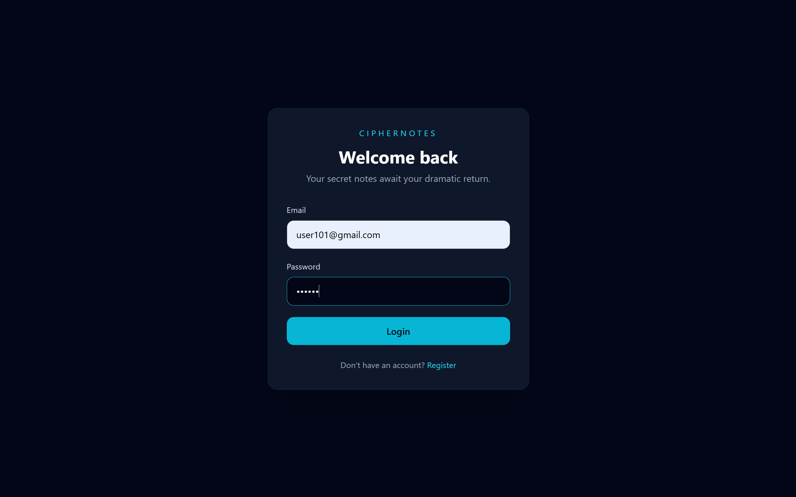
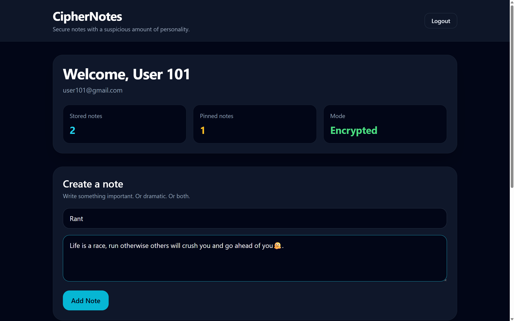
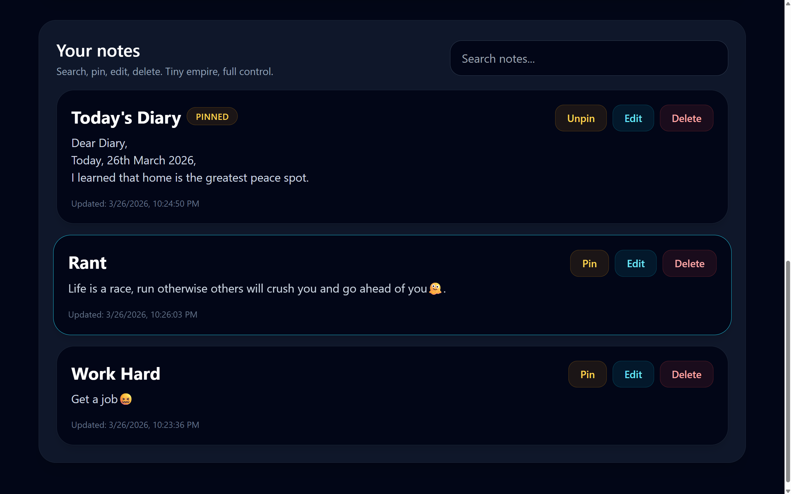

# CipherNotes 🔐

CipherNotes is a full-stack encrypted notes application built with **React + Vite + Tailwind CSS** on the frontend and **Node.js + Express + MongoDB** on the backend.

It allows users to securely create, edit, pin, search, and delete personal notes with **JWT-based authentication** and **AES-encrypted note storage**.

---

## ✨ Features

- User registration and login
- JWT authentication
- Protected frontend routes
- Persistent login with localStorage
- Create notes
- Edit existing notes
- Delete notes
- Pin and unpin notes
- Search notes in real time
- Notes stored per user
- AES encryption for note content before storing in MongoDB
- Clean dark UI built with Tailwind CSS

---

## 🛠️ Tech Stack

### Frontend

- React
- Vite
- Tailwind CSS
- React Router DOM
- Axios

### Backend

- Node.js
- Express.js
- MongoDB
- Mongoose
- bcryptjs
- jsonwebtoken
- dotenv
- crypto

---

## 📁 Project Structure

```bash
encrypted-notes/
├── frontend/
│   ├── public/
│   ├── src/
│   │   ├── assets/
│   │   ├── components/
│   │   │   ├── Navbar.jsx
│   │   │   ├── NoteCard.jsx
│   │   │   ├── NoteForm.jsx
│   │   │   ├── ProtectedRoute.jsx
│   │   │   └── SearchBar.jsx
│   │   ├── context/
│   │   │   └── AuthContext.jsx
│   │   ├── pages/
│   │   │   ├── DashboardPage.jsx
│   │   │   ├── LoginPage.jsx
│   │   │   └── RegisterPage.jsx
│   │   ├── services/
│   │   │   ├── authService.js
│   │   │   └── noteService.js
│   │   ├── App.jsx
│   │   ├── main.jsx
│   │   └── index.css
│   └── package.json
│
├── backend/
│   ├── src/
│   │   ├── config/
│   │   │   └── db.js
│   │   ├── controllers/
│   │   │   ├── authController.js
│   │   │   └── noteController.js
│   │   ├── middleware/
│   │   │   └── authMiddleware.js
│   │   ├── models/
│   │   │   ├── User.js
│   │   │   └── Note.js
│   │   ├── routes/
│   │   │   ├── authRoutes.js
│   │   │   └── noteRoutes.js
│   │   ├── utils/
│   │   │   └── encryption.js
│   │   ├── app.js
│   │   └── server.js
│   └── package.json
│
└── README.md
```

---

## 🔐 Security Highlights

CipherNotes stores note content in encrypted form using **AES-256** encryption before saving to MongoDB.

### Security Flow

- Passwords are hashed using **bcrypt**
- Authentication is handled using **JWT**
- Protected routes verify token before access
- Note content is encrypted before storage
- Notes are decrypted only when fetched for the user

> ⚠️ Note: This project uses a backend-managed encryption key from `.env` for demonstration purposes.

---

## 🚀 Getting Started

### 1. Clone the repository

```bash
git clone https://github.com/Far-200/encrypted-notes.git
cd encrypted-notes
```

---

## ⚙️ Backend Setup

```bash
cd backend
npm install
```

Create `.env` file inside backend:

```env
PORT=5000
MONGO_URI=mongodb://127.0.0.1:27017/encrypted_notes_app
JWT_SECRET=your_super_secret_jwt_key
ENCRYPTION_KEY=12345678901234567890123456789012
```

Run backend:

```bash
npm run dev
```

---

## 💻 Frontend Setup

```bash
cd frontend
npm install
npm run dev
```

---

## 🔄 API Overview

### Auth Routes

| Method | Route                | Description      |
| ------ | -------------------- | ---------------- |
| POST   | `/api/auth/register` | Register user    |
| POST   | `/api/auth/login`    | Login user       |
| GET    | `/api/auth/me`       | Get current user |

### Note Routes

| Method | Route                | Description |
| ------ | -------------------- | ----------- |
| GET    | `/api/notes`         | Get notes   |
| POST   | `/api/notes`         | Create note |
| PUT    | `/api/notes/:id`     | Update note |
| DELETE | `/api/notes/:id`     | Delete note |
| PATCH  | `/api/notes/:id/pin` | Toggle pin  |

---

---

## ✅ CORRECT (this is what you want)

Replace your screenshot section with this:

```md
## 📸 Screenshots

### Login Page



### Dashboard



### Notes View



---

## 🌱 Future Improvements

- Rich text / markdown notes
- Tags and categories
- Archive notes
- Dark/light mode toggle
- Deployment
- Better key management

---

## 🧠 What I Learned

- Full-stack authentication flow
- Secure API design
- Encryption handling
- React state management
- Clean component architecture

---

## 👨‍💻 Author

**Farhaan Khan**

- GitHub: https://github.com/Far-200
- Portfolio: https://farhaankhan.dev

---

## 📜 License

For learning and portfolio use.
```
